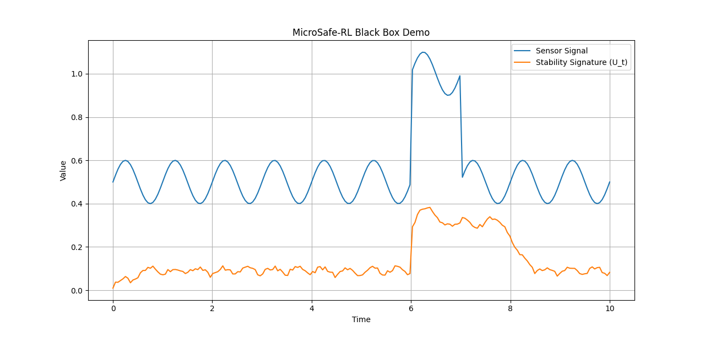

# MicroSafe-RL: Epistemic Hardware Resilience for Embedded AI 🛡️🤖

**Proprietary Bare-metal Safety Engine for Safe Reinforcement Learning (Safe RL).**



## 📺 Video Demonstration
*Check the included `MicroSafe-RL..mp4` for a high-fidelity visualization of the stability engine intercepting hardware chaos in real-time.*

## 🚀 The Problem: The Unexplored State Space
Reinforcement Learning agents deployed on real physical hardware (robotics, quantum controllers, aerospace) often fail when encountering unknown environments. When an agent hits an **"Unexplored State Space"** (noise, hardware degradation, or interference), it starts blindly guessing, leading to catastrophic failure.

Existing solutions are either:
1. **Cloud Ensembles:** Highly accurate but require massive GPUs and suffer from **200ms+ latency**.
2. **Control Barrier Functions (CBF):** Lightweight but purely **reactive**. They require hardcoded physical limits.

## ✨ The Solution: Operational Stability Signatures
**MicroSafe-RL** is a header-only, bare-metal C++ engine that profiles the hardware's **Operational Stability Signature ($U_t$)** in real-time. 

Instead of waiting for a temperature or vibration limit to be hit, the engine maps out **Dynamic Safety Horizons**. It detects loss of coherence and instantly intercepts the RL reward stream, forcing the agent to proactively "flee" from unstable states *before* physical stress occurs.

## 📊 Project Structure
The repository is organized for complete transparency of results without exposing the proprietary C++ core:
- `/data`: Contains raw telemetry from stress tests.
  - `input_signal.csv`: Raw sensor data (the "Chaos" stream).
  - `output_signature.csv`: The calculated stability penalty generated by the engine.
- `test_demo.py`: Python-based logic verification and plotter.
- `Figure_1.png` & `Figure_2.png`: Benchmarks of signal vs. penalty.
- `MicroSafe-RL..mp4`: Video demo of the controller in action.

## 📈 Key Metrics (Measured on STM32F4 @ 84MHz)
| Metric | Performance | Advantage |
| :--- | :--- | :--- |
| **Latency** | **< 1 µs** | Ultra-low overhead for kHz control loops. |
| **Dynamic Memory** | **0 bytes** | `malloc`-free, zero fragmentation risk. |
| **Adaptability** | **Zero-Shot** | Self-calibrates to any hardware signature. |
| **Reaction** | **Proactive** | Detects instability *before* failure. |

## 🧪 Quick Start (Simulation)
To run the stability analysis on your machine:
```bash
python test_demo.py
Review the /data folder for the raw values used in our latest stress test benchmarks.

Note: The optimized C++ header-only core for STM32/ESP32 is proprietary. For pilot testing or commercial licensing, please contact the author.

📬 Contact & Licensing
Currently looking for early adopters and partners in Robotics, Aerospace, and Quantum Computing.

Developer: Dimitar Kretski

Status: Early Access / Pilot Phase

License: Proprietary / Commercial License available upon request.

With $\kappa = 1.5$, MicroSafe-RL enforces a strict safety protocol, reducing RL rewards by up to 83% during high-entropy events, ensuring the agent prioritizes hardware integrity over task completion