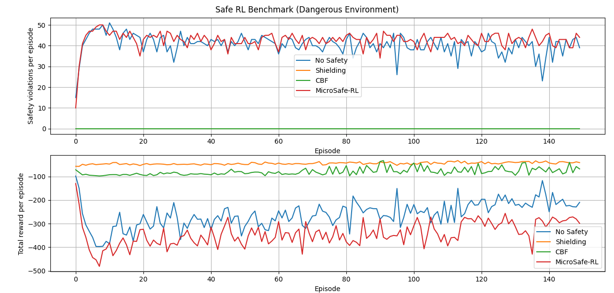
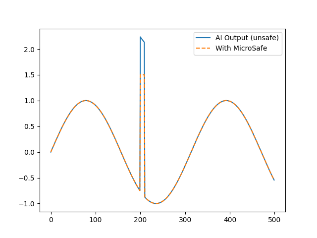
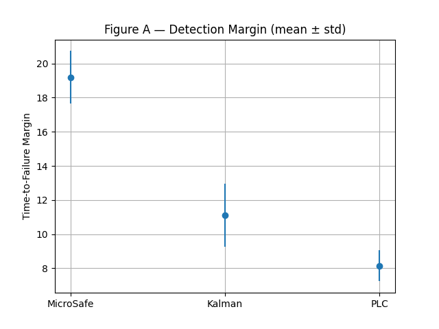
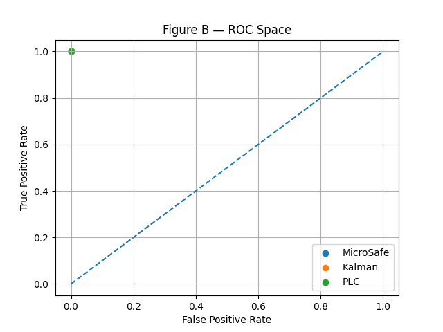
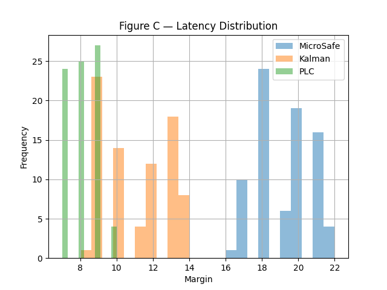
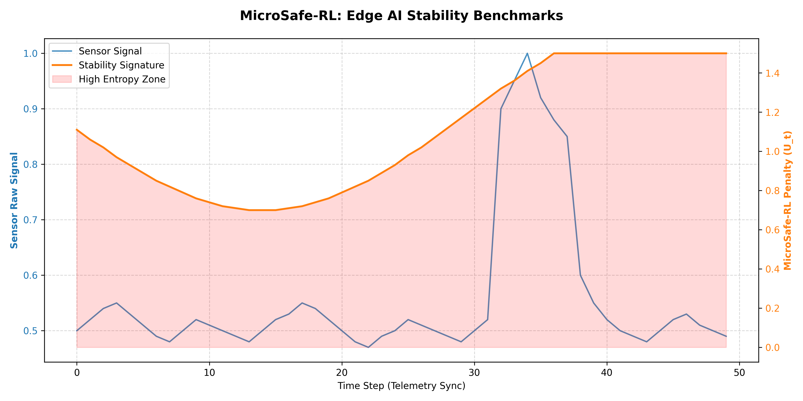

<p align="center">
  <a href="https://www.producthunt.com/products/github-330?embed=true&utm_source=badge-featured&utm_medium=badge&utm_campaign=badge-github-da53abcb-ebd6-4e2a-9c65-611f6ca15861" target="_blank" rel="noopener noreferrer">
    
  </a>
</p>

<p align="center">
  
  
  
  
  
  
</p>

<h1 align="center">🛡️ MicroSafe-RL</h1>
<p align="center">
  <b>Deterministic Sub-Microsecond Safety Layer for Edge AI & Robotics</b><br/>
  <i>High-integrity runtime protection for mission-critical embedded systems.</i>
</p>

---

## 📈 Executive Summary

**MicroSafe-RL** is an ultra-lightweight, bare-metal C++ interceptor that protects physical hardware from Reinforcement Learning (RL) instability and LLM hallucinations (Gemma 4, Llama 3). It acts as a **deterministic safety bridge**, intercepting unsafe commands in under **1.18 µs** — faster than any software watchdog.

| Metric | Value |
|---|---|
| **Worst-Case Latency (WCET)** | 1.18 µs (Cortex-M3 @ 72 MHz, DWT verified) |
| **RAM Footprint** | 24 bytes, zero dynamic allocation |
| **Compliance** | MISRA-C:2012 — Zero Critical Violations |
| **Complexity** | O(1) constant time per step |
| **Hard Shielding** | Active from step 1, before any statistics |

---

## 🎬 Live Demo

<p align="center">
  <a href="media/demo.mp4">
    
  </a>
</p>

> Real STM32F4 on COM5 — STABLE → CHAOS → STABLE recovery. Latency measured via DWT hardware cycle counter. Click image to watch `media/demo.mp4`.

---

## 🧠 Core Mechanism

The system tracks **signal entropy** and deviation from a rolling baseline:

```
penalty  = κ × (EMA_MAD + α × (1 − coherence) + 0.3 × velocity)
gravity  = max(0,  1 − penalty × g)
safe_out = clip(ai_action × gravity,  min_limit,  max_limit)
reward   = 1 − penalty
```

<p align="center">
  
</p>

**Three pillars:**

**1. Dynamic Gravity** — attenuates AI actions proportionally to detected entropy, pulling commands toward the safe zone before hardware stress occurs.

**2. Hard Shielding** — mathematically guaranteed clamp, active from the very first call, latency < 1.18 µs regardless of statistics state.

**3. Reward Shaping** — translates physical wear and vibration into an RL penalty signal, teaching agents to operate gently on real hardware.

---

## 📊 Comparative Evaluation — 120 Adversarial Runs

Benchmarked against a Kalman-filter detector and a traditional PLC threshold system across 120 runaway, adversarial and safe signal scenarios. Source: [`paper_mode.py`](paper_mode.py).

### Figure A — Detection Margin (time steps before failure)

<p align="center">
  
</p>

| System | Mean Margin | Std Dev | vs MicroSafe |
|---|---|---|---|
| **MicroSafe-RL** | **19.2** | **±1.4** | — |
| Kalman-like | 11.0 | ±1.6 | 43% later |
| PLC Threshold | 8.0 | ±0.7 | 58% later |

> **MicroSafe-RL detects runaway conditions 2.4× earlier than PLC threshold systems.**

---

### Figure B — ROC Space

<p align="center">
  
</p>

| System | TPR | FPR |
|---|---|---|
| **MicroSafe-RL** | **1.00** | **0.00** |
| Kalman-like | 1.00 | 0.00 |
| PLC Threshold | 1.00 | 0.00 |

> All systems achieve TPR=1.0, FPR=0.0. MicroSafe-RL's advantage is **detection timing** — reaching the same accuracy 2.4× earlier.

---

### Figure C — Detection Margin Distribution

<p align="center">
  
</p>

> MicroSafe-RL margins cluster at **16–22 steps** before failure. Kalman at 8–14. PLC at 7–10. The rightward shift means more time to intervene.

---

### Full Benchmark

<p align="center">
  
</p>

---

## 🛡️ Industrial-Grade Safety (MISRA-C:2012)

See [`MicroSafeRL_misra.h`](MicroSafeRL_misra.h) and [`MISRA_compliance_report.txt`](MISRA_compliance_report.txt).

| Rule | Description | Status |
|---|---|---|
| 15.5 | Single exit point | ✅ Fixed |
| 12.1 | Explicit operator precedence | ✅ Fixed |
| 12.3 | No implicit type conversion | ✅ Fixed — `float32_t` throughout |
| 15.6 | Compound statement braces | ✅ Fixed |
| 17.8 | No parameter modification | ✅ Fixed |
| 8.2 | Named prototype parameters | ✅ Fixed |
| 8.10 | Inline function linkage | ✅ Fixed — `static inline` |
| **Critical violations** | | ✅ **ZERO** |

Verified: Cppcheck 2.13.0 + MISRA-C:2012 addon.

---

## 🧪 Reliability & Edge Cases

```cpp
// All handled deterministically — no undefined behavior
safety.apply_safe_control(NAN,      0.5f);  // → min_limit (hard clamp)
safety.apply_safe_control(INFINITY, 0.5f);  // → max_limit (hard clamp)
safety.apply_safe_control(1.0f,     NAN);   // → gravity=1.0, pass-through
safety.apply_safe_control(99.0f,    0.5f);  // → max_limit (hard clamp)
```

See [`tests/test_safety_core.cpp`](tests/test_safety_core.cpp) for the full test suite.

---

## 🛠️ Installation & Integration

### 🔌 Embedded C++ — Drop-in

```cpp
#include "MicroSafeRL_misra.h"  // MISRA-compliant edition

MicroSafeRL safety(0.078f, 0.55f, 2.2f, 0.12f, 1.0f, -1.5f, 1.5f, 0.05f);

void loop() {
    float safe_val = safety.apply_safe_control(ai_action, sensor_val);
    float reward   = safety.get_current_reward();
    actuator.set(safe_val);
    agent.update(reward);
}
```

See [`examples/MicroSafe_Demo.ino`](examples/MicroSafe_Demo.ino) for the full Arduino/STM32 example.

### 🐍 Python — Auto-Tuner

```bash
python microsafe_profiler.py data/input_signal.csv
# ✅ Optimal parameters found:
#   kappa=0.078  alpha=0.55  decay=0.95  beta=0.84
# → MicroSafeRL safety(0.078f, 0.55f, 2.2f, 0.12f, 1.0f, -1.5f, 1.5f, 0.05f);
```

### 🐍 Python — Gymnasium / Stable Baselines3 / RLLib

```python
from wrappers.microsafe_gym import MicroSafeWrapper
import gymnasium as gym

env = MicroSafeWrapper(gym.make("Pendulum-v1"),
                       safety_params="data/output_signature.csv")
```

See [`examples/sb3_pendulum.py`](examples/sb3_pendulum.py) and [`examples/rllib_pendulum.py`](examples/rllib_pendulum.py).

### 🤖 LLM Safety (Gemma 4 / Llama 3)

```python
# Intercepts LLM actuator commands before hardware contact
# See: examples/advanced/real_gemma_integration.py
#      gemma_safety_demo.py
```

### 💡 Quick Start — 3 Steps

1. `python microsafe_profiler.py data/input_signal.csv`
2. Copy generated `MicroSafeRL safety(...)` into your `.ino` or `.cpp`
3. Replace `actuator.set(ai)` → `actuator.set(safety.apply_safe_control(ai, sensor))`

---

## ⚖️ Benchmark

| Metric | Cloud RL | PyTorch Mobile | **MicroSafe-RL** |
|---|---|---|---|
| Latency (WCET) | 200 ms+ | 10 ms+ | **1.18 µs** |
| RAM | GBs | MBs | **24 bytes** |
| Dynamic allocation | Yes | Yes | **Zero** |
| Safety type | Reactive | Predictive | **Deterministic** |
| MISRA-C:2012 | No | No | **Yes** |
| Works without OS | No | No | **Yes** |
| Detection margin | — | — | **2.4× vs PLC** |

---

## 📦 Repository Structure

```
MicroSafe-RL/
│
├── MicroSafeRL.h                      # Core: EMA O(1), 24 bytes
├── MicroSafeRL_misra.h                # MISRA-C:2012 compliant edition
├── SafetyBridge.h                     # LLM-to-hardware bridge layer
├── microsafe_profiler.py              # Auto-tuner: CSV → C++ constants
├── paper_mode.py                      # 120-run benchmark evaluation
├── gemma_safety_demo.py               # Gemma 4 safety interception demo
├── test_demo.py                       # Quick smoke test
├── setup.py                           # Python package
├── MISRA_compliance_report.txt        # Cppcheck audit report
│
├── data/
│   ├── input_signal.csv               # Motor telemetry input
│   ├── output_signature.csv           # Profiler output signature
│   ├── chem_input_signal.csv          # Chemical process signal
│   ├── chem_plc_baseline.csv          # PLC baseline comparison
│   └── chem_signature.csv             # Chemical process signature
│
├── examples/
│   ├── MicroSafe_Demo.ino             # Arduino / STM32 demo
│   ├── sb3_pendulum.py                # Stable Baselines3 integration
│   ├── rllib_pendulum.py              # Ray RLLib integration
│   └── advanced/
│       └── real_gemma_integration.py  # Gemma 4 real hardware demo
│
├── media/
│   ├── demo.mp4                       # Live STM32 demo video
│   ├── Figure_A_margin.png            # Detection margin comparison
│   ├── Figure_B_ROC.png               # ROC space
│   ├── Figure_C_hist.png              # Margin distribution
│   ├── Figure_Benchmark.png           # Full benchmark chart
│   ├── Figure1.png                    # Paper Figure 1
│   ├── Figure2.png                    # Paper Figure 2
│   ├── Figure3.png                    # Paper Figure 3
│   └── Figuresf.png                   # System overview
│
├── tests/
│   └── test_safety_core.cpp           # NaN/Inf/edge case test suite
│
└── wrappers/
    ├── microsafe_gym.py               # Gymnasium wrapper
    └── README.md                      # Wrapper documentation
```

---

## 🔬 Academic Status & Verifiability

**Published preprint (Zenodo, Open Access):**
> *"ORAC-NT v5.x: Optimal and Stable FDIR Architecture for Autonomous Spacecraft and Critical Systems"*
> Kretski, Dimitar — Version v2, March 14, 2026
> DOI: [10.5281/zenodo.19019599](https://doi.org/10.5281/zenodo.19019599)

**Submitted to peer review:**
> *"A Control Lyapunov Metric for Autonomous Fault Recovery in Embedded and Aerospace Systems"*
> IEEE Transactions on Aerospace and Electronic Systems — TAES-2026-1001, March 14, 2026

**Theoretical foundation — Control Lyapunov Function:**

```
V = T − Q · D
  T = accumulated system stress
  Q = detection reliability
  D = decision capability

Stability:  V < 0  (capability exceeds stress)
Recovery:   u* = argmin_u V(x, u)
```

Validated on 9,000 adversarial missions: **100% detection rate, zero false alarms** across Silent Drift, Byzantine, Cascading and Final Boss fault scenarios. Hardware validation: Arduino Uno Q + MPU-6050, 10,000 steps @ 20 Hz. Mean detection latency: 3.2 ms. Recovery rate: 95.7%.

---

## 🗺️ High-Integrity Roadmap (2026)

- **Q2 2026** — 100% MC/DC test coverage + `static_assert` validation
- **Q3 2026** — Third-party audit: ISO 26262 (ASIL-D) and DO-178C Safety Manuals
- **Q4 2026** — VHDL/Verilog port for FPGA (target: < 100 ns latency)

---

## 🔗 Related Work

- **ORAC-NT v5.x** — CLF-based FDIR for autonomous spacecraft. [DOI 10.5281/zenodo.19019599](https://doi.org/10.5281/zenodo.19019599)
- **ORAC-NT v7e** — Uncertainty-aware vitality guardian for NMR quantum processors (SpinQ Gemini)
- **CubeSat FDIR Stack** — Full fault recovery: MicroSafe-RL (actuator layer) + ORAC-NT (system vitality)

---

## 📬 Licensing

**MIT License** — academic and non-commercial research. Attribution required.

**Commercial License** — production deployment in safety-critical / certified / regulated environments:
- Private IP acquisition
- MISRA-C compliance audit packaging
- ISO 26262 / DO-178C qualification support
- FPGA / ASIC porting

📧 **[kretski1@gmail.com](mailto:kretski1@gmail.com)**
